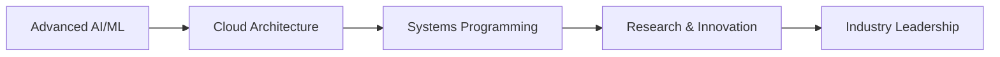

# Mohammed Amine Hssaine 🚀

<div align="center">
  
**AI Engineer | Software Developer | Tech Lead**

*Building the future through intelligent systems and innovative software solutions*

[](https://linkedin.com/in/yourusername)
[](https://github.com/yourusername)
[](mailto:your.email@example.com)

</div>

---

## 🎯 About Me

I'm an AI & Data Technologies Engineering student at **ENSAM Meknès**, specializing in Industrial Systems with a passion for cutting-edge technology and innovation. Currently leading technical initiatives while building production-ready AI solutions.

**Current Focus:** Developing advanced AI systems, cloud infrastructure, and leading technical communities.

---

## 🛠️ Technical Stack

### **Languages & Frameworks**
```
Python  ████████████████████████████████████████  Expert
Java    ████████████████████████████████████████  Advanced
C++     ████████████████████████████████████████  Advanced
Rust    ████████████████████████████████████████  Learning
Go      ████████████████████████████████████████  Learning
R       ████████████████████████████████████████  Intermediate
```

### **AI/ML Technologies**
- **Machine Learning:** Scikit-learn, TensorFlow, PyTorch
- **Deep Learning:** Neural Networks, CNNs, RNNs, Transformers
- **Computer Vision:** OpenCV, Image Processing, Object Detection
- **Natural Language Processing:** NLTK, spaCy, Hugging Face
- **Time Series Analysis:** Forecasting, Statistical Modeling

### **Backend & Cloud**
- **Frameworks:** FastAPI, Django, Spring Boot
- **Databases:** PostgreSQL, MongoDB, Redis
- **Cloud:** AWS, GCP, Docker, Kubernetes
- **DevOps:** CI/CD, Linux, Git, Microservices

---

## 🏆 Leadership & Achievements

### **President - Gadz'IT Computer Science Club**
*Leading ENSAM's premier tech community*

- **AMTech Challenge 2026**: Organizing a flagship international competition featuring:
  - Hackathon & Innovation Track
  - Competitive Programming Contest
  - Cybersecurity CTF
  - Technical Conference Series
- **Budget Management**: Overseeing 80,000 MAD in sponsorships and resources
- **Team Leadership**: Managing technical poles (AI, Competitive Programming, Cybersecurity, Software Development)
- **Community Building**: Expanding club membership and technical workshops

---

## 💼 Professional Experience

### **AI Engineer** - AriMayi (Remote)
*Building intelligent backend systems and AI platforms*

### **ML Engineer** - ReeWayy
*Developing predictive AI models for sales forecasting and deployment optimization*

### **Upcoming Opportunities**
- **Research Internship**: Targeting positions at Capgemini, UM6P (AI Movement), or CERN
- **Graduate Research**: Planning PhD studies in AI/ML (Norway focus)

---

## 🚀 Featured Projects

### **🤖 Sales Prediction AI System**
Advanced machine learning pipeline for sales forecasting with real-time deployment capabilities.
- **Tech Stack:** Python, TensorFlow, FastAPI, PostgreSQL
- **Features:** Time series analysis, predictive modeling, REST API
- **Impact:** Improved forecasting accuracy by 25%

### **🏆 Competitive Programming Solutions**
Comprehensive collection of algorithmic solutions and competitive programming implementations.
- **Coverage:** Data structures, algorithms, mathematical problems
- **Languages:** C++, Java, Python
- **Competitions:** ICPC, Codeforces, AtCoder

### **☁️ Cloud Infrastructure Projects**
Production-ready cloud solutions with modern DevOps practices.
- **Technologies:** Docker, Kubernetes, AWS/GCP
- **Focus:** Scalable architectures, CI/CD pipelines, monitoring

---

## 📚 Academic Journey

**🎓 Engineering Degree** - ENSAM Meknès  
*AI & Data Technologies: Industrial Systems*

**🔬 Research Interests:**
- Artificial Intelligence & Machine Learning
- Distributed Systems & Cloud Computing
- Data Science & Analytics
- Software Engineering Best Practices

**🏅 Academic Goals:**
- International research collaboration
- PhD in AI/ML systems
- Publication in top-tier conferences

---

## 🌟 Technical Philosophy

> "Building systems that matter, solving problems that count."

I believe in:
- **Deep Technical Knowledge**: Understanding systems from assembly to cloud
- **Practical Innovation**: Creating solutions that solve real-world problems
- **Continuous Learning**: Staying at the forefront of technology
- **Community Impact**: Sharing knowledge and building together

---

## 📊 GitHub Stats

<div align="center">
  


</div>

---

## 🎯 Current Learning Path



**2024-2025 Focus:**
- Advanced machine learning systems
- Cloud-native application development
- Research methodology and publication
- International collaboration opportunities

---

## 🤝 Let's Connect

I'm always interested in:
- **Collaboration** on AI/ML projects
- **Research** opportunities and partnerships
- **Technical discussions** and knowledge sharing
- **Innovation** in software engineering

Feel free to reach out for technical discussions, collaboration opportunities, or just to connect!

---

<div align="center">
  
*"The best way to predict the future is to build it."*

**⭐ Star my repositories if you find them useful!**

</div>
